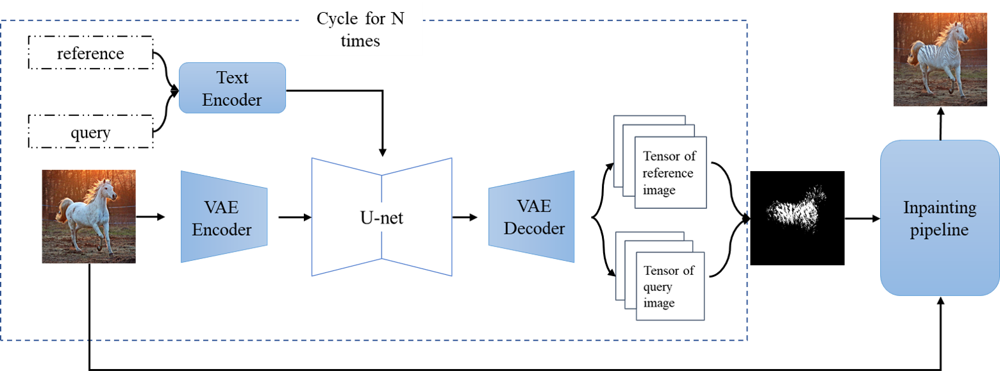
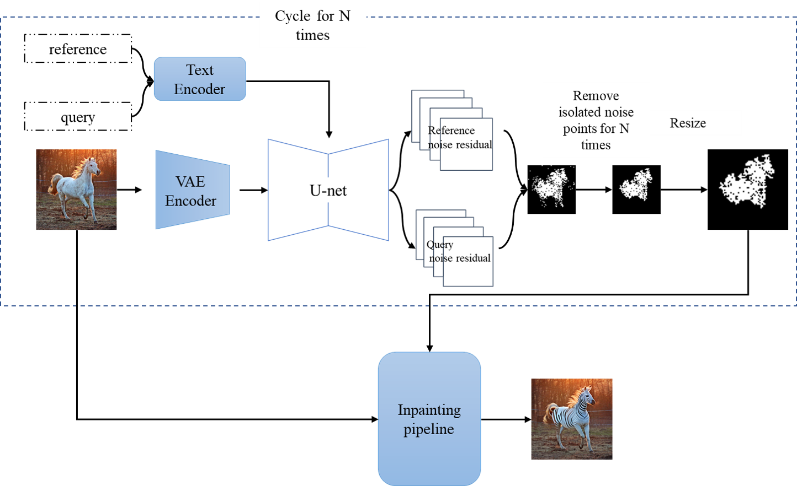
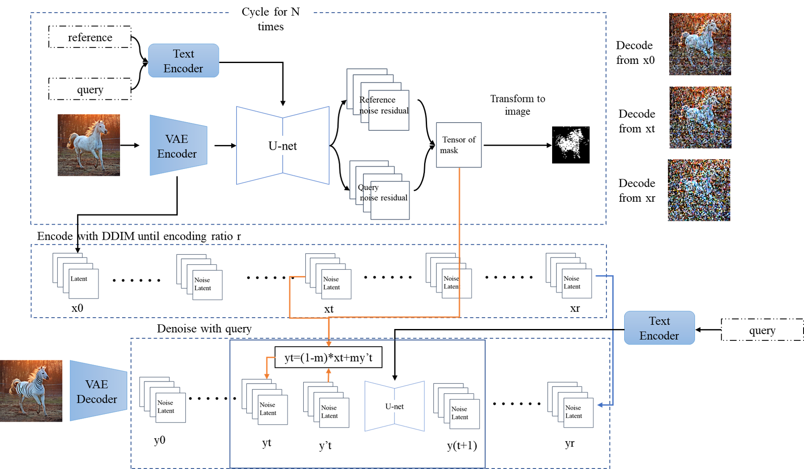
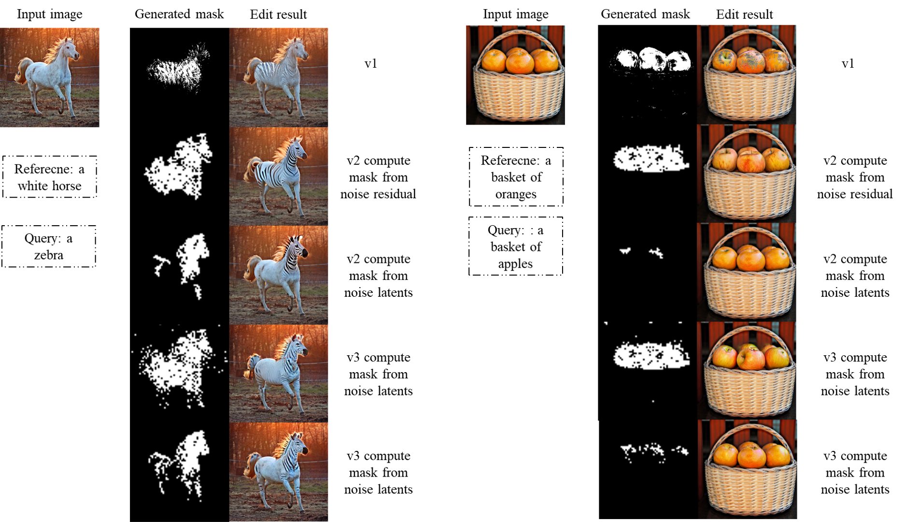

# Edit Image base on the Mask generated from the stable diffusion itself
## Introduction 
This is an unofficial implementation of the paper [DiffEdit: Diffusion-based semantic image editing with mask guidance](https://arxiv.org/abs/2210.11427) based on [Stable Diffusion](https://arxiv.org/abs/2112.10752) 
* All the weights and apis are token from [Hugging Face Diffusers](https://huggingface.co/docs/diffusers/index)
* weights of the Stable Diffusion img2imgpipeline are from [runwayml/stable-diffusion-v1-5](https://huggingface.co/runwayml/stable-diffusion-v1-5), you can get by this command:
```shell
cd ckpt
bash runwayml_sd_v1_5.sh
```
* weights of the Stable Diffusion inpaintingpipeline are from [stabilityai/stable-diffusion-2-inpainting](https://huggingface.co/stabilityai/stable-diffusion-2-inpainting), you can get by this command:
```shell
cd ckpt
bash inpaint_ckpt.sh
```
* Scheduler is [DDIMScheduler](https://huggingface.co/docs/diffusers/api/schedulers/ddim)
* Example images are from [Google TEDBench](https://github.com/imagic-editing/imagic-editing.github.io/tree/main/tedbench)
* Hugging Face Diffusers has provided api for this paper, [see this](https://huggingface.co/docs/diffusers/main/en/api/pipelines/stable_diffusion/diffedit)
## Environment
```
python == 3.9.12
torch == 1.13.1
pillow == 9.4.0
scikit-image == 0.19.2
diffusers == 0.15.0
xformers == 0.0.16
accelerate == 0.17.1
```
with the following codes, you can use the GPU with 6GB memory to run the codes, edit image with the size of 512x512 
```python
pipe.enable_xformers_memory_efficient_attention()
pipe.enable_attention_slicing()
pipe.vae.enable_tiling()
pipe.enable_model_cpu_offload()
```
## Method
### v1
Mask is computed from the images generated by img2imgpipeline, and edit operation is implemented by inpaintingpipeline base on the mask image, as shown in the figure below

you can run v1 method by this command:
```shell
bash diffedit_v1.sh
```
if you want to use other image or hyperparameters, please edit the diffedit_v1.sh
### v2
Mask is computed from the noise residual(**you can also use the noise latents, just change the '--not_residual_guide' in .sh files**) in latent space by img2imgpipeline, then the mask is resized to the size of the image, edit operation is implemented by inpaintingpipeline base on the resized mask image, as shown in the figure below

you can run v2 method by this command:
```shell
bash diffedit_v2.sh
```
if you want to use other image or hyperparameters, please edit the diffedit_v2.sh
### v3
Mask is computed from the noise residual(**you can also use the noise latents, just change the '--not_residual_guide' in .sh files**) in latent space by img2imgpipeline,edit operation is implemented by img2imgpipeline base on the mask, as shown in the figure below

you can run v3 method by this command:
```shell
bash diffedit_v3.sh
```
if you want to use other image or hyperparameters, please edit the diffedit_v3.sh
## Result

## Reference
The following repository also provides the code implementation of this:
* [Xiang-cd/DiffEdit-stable-diffusion](https://github.com/Xiang-cd/DiffEdit-stable-diffusion)
* [aayushmnit/diffusion_playground](https://github.com/aayushmnit/diffusion_playground/blob/main/notebooks/4_DiffEdit_v4.ipynb)
* [johnrobinsn/diffusion_experiments](https://github.com/johnrobinsn/diffusion_experiments/blob/main/DiffEdit.ipynb)
* [daspartho/DiffEdit](https://github.com/daspartho/DiffEdit)
## What's more
if you have any questions, feel free to contact me with wangruilin.will@foxmail.com


